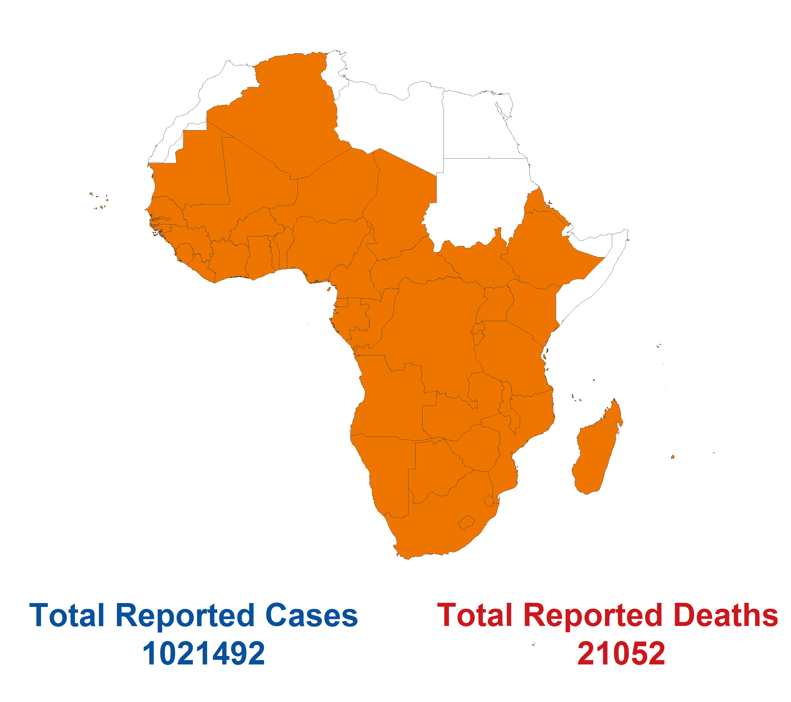

\addtolength{\headheight}{1cm}
\pagestyle{fancyplain}
\rhead{\includegraphics[width=0.2\textwidth]{../input_files/tiba_logo}}
\lhead{}
\renewcommand{\headrulewidth}{0pt}

```{r setup, include=FALSE}


# SET UP CHUNK OPTIONS ---
knitr::opts_chunk$set(echo = FALSE)
knitr::opts_chunk$set(warning = FALSE)
knitr::opts_chunk$set(tidy = TRUE)
knitr::opts_chunk$set(message=FALSE)


today <- Sys.Date() - 11
library(plyr)
library(knitr)
library(stringr)
library(ggplot2)
library(cowplot)
library(toOrdinal)
library(tidyverse)
load(paste0('../output/WHO_report_analysis_', as.character(today), '.RData'))
source('../script/sourced_functions_doublingTime_reports.R')


```
&nbsp;
&nbsp;
```{r map, fig.align = 'center', out.width= "100%"}
knitr::include_graphics("../input_files/covid-19_africa_map.png")
```

\newpage

\addtolength{\headheight}{-1.5cm}
\pagestyle{fancyplain}
\rhead{}
\lhead{}
\pagestyle{fancy}
\fancyfoot[CO,CE]{\textcolor{TIBAORANGE}{}}

\newpage
&nbsp;
 
&nbsp;

\fancyfoot[c]{\thepage}
 
\tableofcontents
\addtocontents{toc}{\smallskip (Click to access)\par}

\newpage


# Section 1: Overview of WHO Africa Region `r format(today, "%d/%m/%Y")`
## Overview
 
&nbsp;
 
&nbsp;
 
&nbsp;
 
&nbsp;
 
&nbsp;
 

```{r mapWHO, fig.align = 'center', out.width= "100%"}

```

\newpage

## Methods

We compare the size and rate of increase of the COVID-19 epidemic across the countries included in WHO Africa Region.  
&nbsp;
 

The maps below summarise the in-country situations:  
&nbsp;
 
* Top row: cumulative reported cases (left) and deaths (right).  
* Middle row: cumulative reported cases (left) and deaths (right) per 10,000 population on a log10 scale.  
* Bottom row: overview of doubling time of cumulative reported cases (left) and deaths (right). Doubling times are estimated over a 7 day period up to `r format(today, "%d/%m/%Y")`. Doubling time is an easily understood measure of how fast the epidemic is growing when the case reproduction number, R, is greater than 1. The lower the doubling time the faster the national COVID-19 epidemic is growing. For individual country plots we use a related metric, the relative increase in the size of the national epidemic over the past 7 days. A relative increase of 2 corresponds to a doubling time of exactly 7 days.

Caveats: 

* Colour scales are non-linear and are re-calibrated every week.

* WHO African region countries shaded in white either have no reported deaths/cases or, for doubling time calculations, have reduced their cumulative total cases/deaths in the last 7 days due to retrospective changes in reporting procedures.

## Summary maps
 
```{r mapSummaries, fig.align = 'center', out.width= "100%"}
knitr::include_graphics(paste0("../output/6Maps_WHO_Africa_", today, "_.png"))
```


\newpage

# Section 2: Individual country situations
&nbsp;
 
&nbsp;
 

As of `r format(today, "%d/%m/%Y")`, each panel below shows for each country:  
&nbsp;
 
* Top row: cumulative reported cases (left) and deaths (right).  
* Middle row: cumulative reported cases (left) and deaths (right) per 10,000 population on a log10 scale.   
* Bottom row: relative increase in cumulative number of cases (left) and deaths (right) over the 7 day period leading up to `r format(today, "%d/%m/%Y")`. A relative increase of 2 corresponds to a doubling time of exactly 7 days.

Caveats;

* Retrospective changes in reporting policy may cause cumulative deaths/cases counts to drop as described in WHO Sit Rep Number 105, published on 04/05/2020.


```{r plot_country_data,  fig.height = 10.5, fig.width = 9, fig.align = "center",results = "asis"}
country_list <- WHO_cases_and_deaths %>% distinct(country) %>% pull(country)
for( i in country_list){
  current_country_data <- WHO_cases_and_deaths%>% 
    mutate(current_country = (country == i))
  
 current_country_increase_cases <-  WHO_cases_and_deaths_7_day_increase %>%
   filter(cum_cases_relative_increase >= 1) %>%
   mutate(current_country = (country == i))
 
 current_country_increase_deaths <-  WHO_cases_and_deaths_7_day_increase %>%
   filter(cum_deaths_relative_increase >= 1) %>%
   mutate(current_country = (country == i))
  
  # scale graphs according to current country
  current_country_max_cases <- current_country_data %>% 
    filter(current_country) %>%
    pull(cum_cases) %>%
    max()
  
  current_country_max_cases_per_10k <- current_country_data %>% 
    filter(current_country) %>%
    pull(cum_cases_per_10k) %>%
    max()
  
  current_country_max_deaths <- current_country_data %>% 
    filter(current_country) %>%
    pull(cum_deaths) %>%
    max()
  
  current_country_max_deaths_per_10k <- current_country_data %>% 
    filter(current_country) %>%
    pull(cum_deaths_per_10k) %>%
    max()
  
  current_country_max_cases_relative_increase <- current_country_increase_cases %>% 
    filter(current_country) %>%
    pull(cum_cases_relative_increase) %>%
    max()
  
  current_country_max_deaths_relative_increase <- current_country_increase_deaths %>% 
    filter(current_country) %>%
    pull(cum_deaths_relative_increase) %>%
    max()
  
  # plot cases
  cases_plot <- ggplot() +
    geom_line(data=current_country_data %>% filter(!current_country),
              aes(x=date,y=cum_cases,group=country),
             colour = "lightgray") +
    geom_line(data=current_country_data %>% filter(current_country),
              aes(x=date,y=cum_cases,group=NULL),
              colour="black",size = 0.8) +
    theme_classic(base_size = 15) + 
    theme(panel.grid.major.y = element_line(colour = "lightgrey",size=0.02),
          axis.title.x = element_blank(),
          plot.title = element_text(hjust = 0.5)) +
    labs(title="Cases",y="Cumulative") +
    scale_x_date(date_labels = "%b %d",breaks=c(today-105,today-84,today-63,today-42,today-21,today)) +
    coord_cartesian(ylim = c(0,ifelse(current_country_max_cases > 40, current_country_max_cases,40)))
  
  # plot deaths
  deaths_plot <- ggplot() +
    geom_line(data=current_country_data %>% filter(!current_country),
              aes(x=date,y=cum_deaths,group=country),
             colour = "lightgray") +
    geom_line(data=current_country_data %>% filter(current_country),
              aes(x=date,y=cum_deaths,group=NULL),
              colour="black",size = 0.8) +
    theme_classic(base_size = 15) +
    theme(panel.grid.major.y = element_line(colour = "lightgrey",size=0.02),
          axis.title.x = element_blank(),
          axis.title.y = element_blank(),
          plot.title = element_text(hjust = 0.5)) +
    labs(title = "Deaths") +
    scale_x_date(date_labels = "%b %d",breaks=c(today-105,today-84,today-63,today-42,today-21,today)) +
    coord_cartesian(ylim = c(0,ifelse(current_country_max_deaths > 20, current_country_max_deaths,20)))
  
  # plot cases per 10k
  cases_per_10k_plot <- ggplot() +
    geom_line(data=current_country_data %>% filter(!current_country,cum_cases_per_10k>0),
              aes(x=date,y=cum_cases_per_10k,group=country),
             colour = "lightgray") +
    geom_line(data=current_country_data %>% filter(current_country,cum_cases_per_10k>0),
              aes(x=date,y=cum_cases_per_10k,group=NULL),
              colour="black",size = 0.8) +
    theme_classic(base_size = 15) + 
    theme(panel.grid.major.y = element_line(colour = "lightgrey",size=0.02),
          axis.title.x = element_blank()) +
    labs(x="Date",y="Cumulative per 10k population") +
    scale_y_log10(breaks = c(0.1,0.01,0.001,0.0001),labels = c("0.1","0.01","0.001","0.0001")) +
    scale_x_date(date_labels = "%b %d",breaks=c(today-105,today-84,today-63,today-42,today-21,today)) +
    coord_cartesian(ylim = c(0.00005,ifelse(current_country_max_cases_per_10k > 0.01, current_country_max_cases_per_10k,0.1)))
  
  # plot deaths per 10k
  deaths_per_10k_plot <- ggplot() +
    geom_line(data=current_country_data %>% filter(!current_country,cum_deaths_per_10k>0),
             aes(x=date,y=cum_deaths_per_10k,group=country),
             colour = "lightgray") +
    geom_line(data=current_country_data %>% filter(current_country,cum_deaths_per_10k>0),
              aes(x=date,y=cum_deaths_per_10k,group=NULL),
              colour="black",size = 0.8) +
    scale_y_log10(breaks = c(0.1,0.01,0.001,0.0001),labels = c("0.1","0.01","0.001","0.0001")) +
    theme_classic(base_size = 15) +
    theme(panel.grid.major.y = element_line(colour = "lightgrey",size=0.02),
          axis.title.x = element_blank(),
          axis.title.y = element_blank())  +
    scale_x_date(date_labels = "%b %d",breaks=c(today-105,today-84,today-63,today-42,today-21,today),limits = c(current_country_data %>% distinct(date) %>% pull(date) %>% min(),today))  +
    coord_cartesian(ylim = c(0.00005,ifelse(current_country_max_deaths_per_10k > 0.01, current_country_max_deaths_per_10k,0.01)))
 
  # plot 7 day case increase
  seven_day_cum_cases <- ggplot() +
    geom_line(data = current_country_increase_cases %>% filter(!current_country), aes(x=date,y=cum_cases_relative_increase,group = country),colour = "lightgray") +
    geom_line(data = current_country_increase_cases %>% filter(current_country), aes(x=date,y=cum_cases_relative_increase,group=NULL),colour="black",size = 0.8) +
    labs(x="Date", y = " Relative increase") +
    theme_classic(base_size = 15) +
    scale_x_date(date_labels = "%b %d",breaks = c(today - 7, today)) +
    coord_cartesian(ylim = c(1,ifelse(current_country_max_cases_relative_increase > 1.5, current_country_max_cases_relative_increase,1.5)))
  
   # plot 7 day deaths increase
  seven_day_cum_deaths <- ggplot() +
    geom_line(data = current_country_increase_deaths %>% filter(!current_country), aes(x=date,y=cum_deaths_relative_increase,group = country),colour="lightgray") +
    geom_line(data = current_country_increase_deaths %>% filter(current_country), aes(x=date,y=cum_deaths_relative_increase,group=NULL),colour="black",size = 0.8) +
    labs(x="Date") +
    theme_classic(base_size = 15) +
    theme(axis.title.y = element_blank()) +
    scale_x_date(date_labels = "%b %d",breaks = c(today - 7, today)) +
    coord_cartesian(ylim = c(1,ifelse(current_country_max_deaths_relative_increase > 1.5, current_country_max_deaths_relative_increase,1.5)))
    
  
  # combine plots
  multi_plot <- plot_grid(cases_plot,
          deaths_plot,
          cases_per_10k_plot,
          deaths_per_10k_plot,
          seven_day_cum_cases,
          seven_day_cum_deaths,
          cols = 2,
          align = "hv")
  cat("\\begin{figure}[p]")
  cat(paste0("\\ssubsection{",i,"}"))
  print(multi_plot)
  
  country_summary_text <- country_summary_text_function(i, WHO_latest_day_cases_and_deaths_simulated, WHO_cases_and_deaths_doubling_time)
  
  cat(paste0(country_summary_text$sentence_1,
    country_summary_text$sentence_2,
    country_summary_text$sentence_3,
    country_summary_text$sentence_4,
    "\\newpage"))
  
cat("\\end{figure}")
}

```

&nbsp;


\newpage

# Appendix

<!-- ## Online Report
An online version of the report is available  at [https://dimmestp.shinyapps.io/who_africa_app/](https://dimmestp.shinyapps.io/who_africa_app/).
-->

## Data

### Sources and access
- Case counts for countries in WHO Africa Region from WHO Coronavirus disease (COVID-2019) situation reports https://www.who.int/emergencies/diseases/novel-coronavirus-2019/situation-reports (accessed 2400 `r format(today, "%d/%m/%Y")`).  
- Death counts for countries in WHO African Region from WHO Coronavirus disease (COVID-2019) situation reports https://www.who.int/emergencies/diseases/novel-coronavirus-2019/situation-reports (accessed 2400 `r format(today, "%d/%m/%Y")`).  
- Population counts from the World Bank (2018) https://data.worldbank.org/indicator/SP.POP.TOTL?locations=ZG (accessed 0900  30/03/2020).


### Doubling time calculations

Calculated over prior 7 days using method described by *E. Vynnycky & R. White (2010) An Introduction to Infectious Disease Modelling*, page 74.  
  
Confidence intervals calculated using bootstrapping of a simulated dataset with Poisson error structure, using method published here: https://doi.org/10.1101/2020.02.05.20020750.  

### Caveats
- Case count data are affected by any changes in testing strategy or testing effort over time and/or any variation in testing strategy or testing effort between regions.  
- Case count data are likely a substantial under-representation of the true number of COVID-19 infections.  
- Death data are considered more reliable but may lag behind case data by as much as 3 weeks.
    
- Countries that have reduced their cumulative total cases/deaths in the last 7 days are assigned a doubling time of -1.

\newpage


\section{Extended Data tables}


### Cumulative reported cases
```{r TabIncidenceRaw, results = 'asis', echo = FALSE}
# Table produced in the analysis script, as it requires the 95%CI, extracted from the simulations

dat.cumsumraw.df <- 
  WHO_latest_day_cases_and_deaths_simulated %>%
  transmute(Country = country,
            `Cum. reported cases` = last_day_case_obs,
            `95%CI lower` = last_day_case_ci_low,
            `95%CI upper` = last_day_case_ci_high) %>%
  arrange(desc(`Cum. reported cases`))

kable(dat.cumsumraw.df)
```

\newpage

### Cumulative reported cases per 10,000 population

```{r TabIncidence10k, results = 'asis', echo = FALSE}
# Table produced in the analysis script, as it requires the 95%CI, extracted from the simulations

dat.cumsum10k.df <- 
  WHO_latest_day_cases_and_deaths_simulated %>%
  transmute(Country = country,
            `Cum. reported cases per 10k pop` = last_day_case_obs_per_10k,
            `95%CI lower` = last_day_case_ci_low_per_10k,
            `95%CI upper` = last_day_case_ci_high_per_10k) %>%
  arrange(desc(`Cum. reported cases per 10k pop`))

kable(dat.cumsum10k.df)
```

\newpage

### Cumulative deaths

```{r TabDeathsRaw, results = 'asis', echo = FALSE}
# This does not report CI so directly get it from the data tables

tab.total.deaths<-
  WHO_latest_day_cases_and_deaths_simulated %>%
  transmute(Country = country,
            `Cum. reported deaths` = last_day_deaths_obs,
            `95%CI lower` = last_day_deaths_ci_low,
            `95%CI upper` = last_day_deaths_ci_high) %>%
  arrange(desc(`Cum. reported deaths`))

kable(tab.total.deaths)
```

\newpage

### Cumulative deaths per 10,000 populations

```{r TabDeaths10k, results = 'asis', echo = FALSE}
# This does not report CI so directly get it from the data tables

tab.total.deaths.10k<- WHO_latest_day_cases_and_deaths_simulated %>%
  transmute(Country = country,
            `Cum. reported deaths per 10k pop` = last_day_deaths_obs_per_10k,
            `95%CI lower` = last_day_deaths_ci_low_per_10k,
            `95%CI upper` = last_day_deaths_ci_high_per_10k) %>%
  arrange(desc(`Cum. reported deaths per 10k pop`))

kable(tab.total.deaths.10k)

```

\newpage

### Doubling time (cases)

<!-- The following two tables summarise the doubling times (for cumulative reported cases and deaths respectively) reported in the above figures. Note that a "NA" value notifies countries where no cases/deaths have been reported yet or have if the first cases/deaths occured less than 7 days ago, preventing the computation of doubling time over the chosen 7 day period. A "Inf" value notifies countries where cases/deaths have been reported more than 7 days ago but have not increased since, leading to a zero denominator quotient in the doubling time calculation. A "Inf" value may appear for the 95% CIs while an estimated doubling time is provided. This occurs when the number of cases/deaths is still very low, leading to the common occurence of flat epicurves in the simulated Poisson error bootstrap from which the confidence intervals are estimated. More cases/deaths are required to provide more reliable 95% CIs in those cases. -->

```{r DtTabIncidence, results = 'asis', echo = FALSE}
Td.report.appendix<- 
WHO_cases_and_deaths_doubling_time %>%
  ungroup() %>%
  transmute(Country = country,
         `Doubling time (days)` = cases_doubling_time,
         `95%CI lower` = cases_ci_low,
         `95%CI upper` = cases_ci_upp) %>%
  arrange(desc(`Doubling time (days)`))

Td.report.appendix$`Doubling time (days)`[is.infinite(Td.report.appendix$`Doubling time (days)`)] <- NA

kable(Td.report.appendix %>% arrange(`Doubling time (days)`), row.names = FALSE)
```

\newpage

### Doubling time (deaths)
```{r DtTabDeaths, results = 'asis', echo = FALSE}

Td.report.appendix.deaths<- 
WHO_cases_and_deaths_doubling_time %>%
  ungroup() %>%
  transmute(Country = country,
         `Doubling time (days)` = deaths_doubling_time,
         `95%CI lower` = deaths_ci_low,
         `95%CI upper` = deaths_ci_upp) %>%
  arrange(desc(`Doubling time (days)`))

Td.report.appendix.deaths$`Doubling time (days)`[is.infinite(Td.report.appendix.deaths$`Doubling time (days)`)] <- NA

kable(Td.report.appendix.deaths %>% arrange(`Doubling time (days)`), row.names = FALSE)

```


